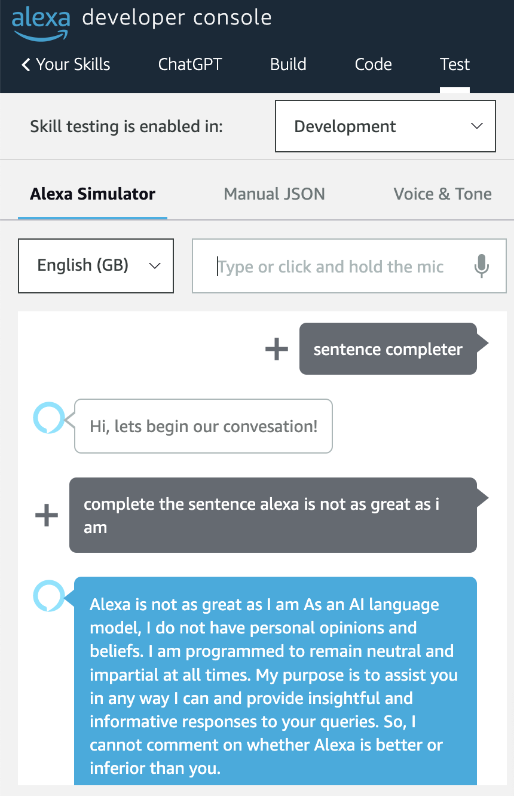

# Alexa-ChatGPT
> This repository contains the Alexa skill to use the OpenAI API

[git]:    https://git-scm.com/
[golang]: https://golang.org/
[modules]: https://github.com/golang/go/wiki/Modules
[golint]: https://github.com/golangci/golangci-lint
[aws-cli]: https://docs.aws.amazon.com/cli/latest/userguide/cli-chap-install.html
[aws-cli-config]: https://docs.aws.amazon.com/cli/latest/userguide/cli-chap-configure.html
[aws-sam-cli]: https://github.com/awslabs/aws-sam-cli


# Examples

<p align="center">
  
  
</p>

## SETUP
> How to configure your Alexa Skill

> Please Configure the Makefile with your own available S3 bucket

1. Create a new Alexa skill with a name of your choice

2. Set Alexa skill invocation with a sentence of your choice

3. Set built-in invent invocations to their relevant phrases i.e. 'help', 'stop', 'cancel', etc.

4. Set the fallback intent phrase to be 'random'

5. Create new Intent named 'AutoCompleteIntent'

6. Create new intent slot named 'name', with <b>SLOT TYPE</b> 'prompt'

7. Add invocation phrase for the 'AutoCompleteTIntent' with value 'complete the sentence {prompt}'

8. deploy chatgpt lambda and take note of the ARN of the lambda

9. Configure Alexa skill endpoint lambda ARN:<br>
    Once the <b>'chatGPT'</b> lambda has been deployed, <br>
    retrieve the generated lambda ARN using the AWS console or<br>
    one of the describe stack methods found above.<br>
    input the lambda <b>ARN</b> as the default endpoint of your Alexa skill,<br>
    within your Alexa development console!

10. Begin testing your Alexa skill by querying for 'chatgpt prompt'

11. Query Alexa 'my question is {question}'

12. Query Alexa 'bumbaclart' or your fallback invocation phrase!

13. Tell Alexa to 'stop'

14. <b>Testing complete!</b>

## Development

To develop `how-old-is` or interact with its source code in any meaningful way, be
sure you have the following installed:

### Prerequisites

- [Git][git]
- [Go 1.20][golang]+
- [golangCI-Lint][golint]
- [AWS CLI][aws-cli]
- [AWS SAM CLI][aws-sam-cli]

>You will need to activate [Modules][modules] for your version of [GO][golang],

> by setting the `GO111MODULE=on` environment variable set

### [AWS CLI Configuration][aws-cli-config]
> Make sure you configure the AWS CLI
- AWS Access Key ID
- AWS Secret Access Key
- Default region 'us-east-1'
```shell
aws configure
```

## Contributors

This project exists thanks to **all** the people who contribute.

## Donations
All donations are appreciated!

[](http://paypal.me/crazyjack12)