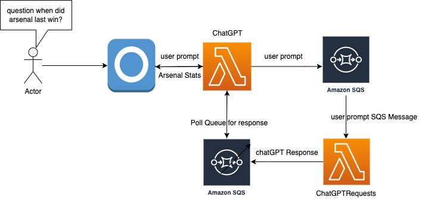
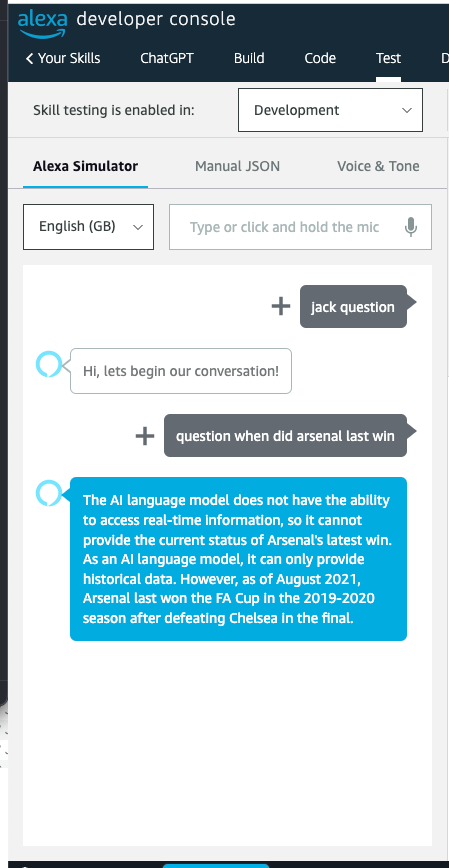

# Alexa-ChatGPT
> This repository contains the Alexa skill to use the OpenAI API

[git]:    https://git-scm.com/
[golang]: https://golang.org/
[modules]: https://github.com/golang/go/wiki/Modules
[golint]: https://github.com/golangci/golangci-lint
[aws-cli]: https://docs.aws.amazon.com/cli/latest/userguide/cli-chap-install.html
[aws-cli-config]: https://docs.aws.amazon.com/cli/latest/userguide/cli-chap-configure.html
[aws-sam-cli]: https://github.com/awslabs/aws-sam-cli


[](https://goreportcard.com/report/github.com/jackmcguire1/alexa-chatgpt)
[](https://codecov.io/gh/jackmcguire1/alexa-chatgpt)


# Infrastructure
  

# Examples

<p align="center">
  
  </p>

## SETUP
> How to configure your Alexa Skill

> Please Configure the Makefile with your own available S3 bucket

1. Create a new Alexa skill with a name of your choice

2. Set the Alexa skill invocation with a phrase i.e. 'My question'

3. Set built-in invent invocations to their relevant phrases i.e. 'help', 'stop', 'cancel', etc.

5. Create a new Intent named 'AutoCompleteIntent'

6. Add a new Alexa slot to this Intent and name it 'prompt' with type AMAZON.SearchQuery'

7. Add invocation phrase for the 'AutoCompleteIntent' with value 'complete the sentence {prompt}'

8. Deploy the stack to your AWS account. > sam build  && sam deploy --stack-name chatGPT

9. Once the stack has deployed, Configure the Alexa skill Endpoint, apply the default region lambda ARN:<br>
    Once the <b>'chatGPT'</b> lambda has been deployed, <br>
    retrieve the generated lambda ARN using the AWS console or sam describe

10. Begin testing your Alexa skill by querying for 'My question' or your chosen invocation phrase, Alexa should respond with "Hi, let's begin our conversation!"

11. Query Alexa 'question {your sentence here}'

11. > Note the OpenAI API may take longer than 8 seconds to respond, in this scenario Alexa will tell you your answer will be ready momentarily, simply then ask Alexa 'last response'

12. Tell Alexa to 'stop'

13. <b>Testing complete!</b>

## Development

To develop `how-old-is` or interact with its source code in any meaningful way, be
sure you have the following installed:

### Prerequisites

- [Git][git]
- [Go 1.20][golang]+
- [golangCI-Lint][golint]
- [AWS CLI][aws-cli]
- [AWS SAM CLI][aws-sam-cli]

### [AWS CLI Configuration][aws-cli-config]
> Make sure you configure the AWS CLI
- AWS Access Key ID
- AWS Secret Access Key
- Default region 'us-east-1'
```shell
aws configure
```

## Contributors

This project exists thanks to **all** the people who contribute.

## Donations
All donations are appreciated!

[](http://paypal.me/crazyjack12)
