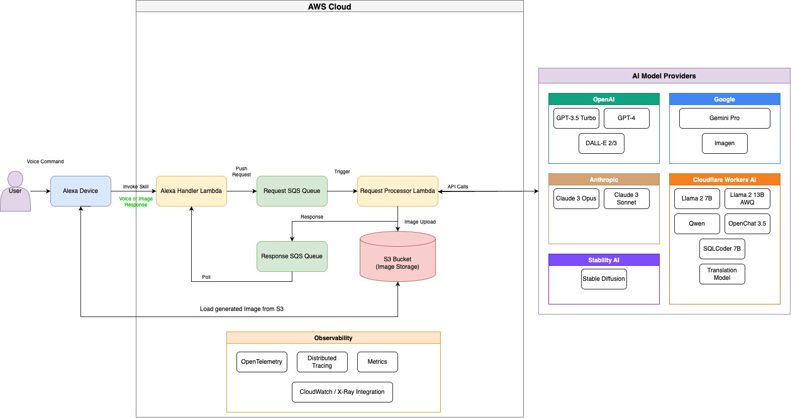
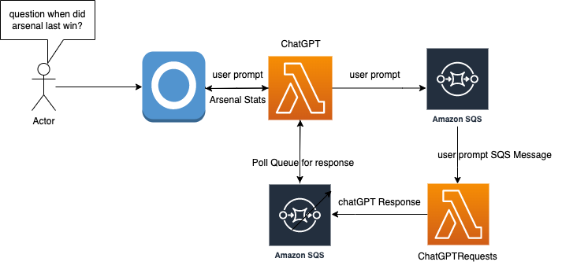

# Alexa-ChatGPT

> 🎤 A production-ready serverless Alexa skill backend powered by **AWS Bedrock** and **Cloudflare Workers AI**, giving you access to Claude, Nova, Grok, GPT, Llama, Gemma, Kimi, and Flux models through your Alexa device.

[git]: https://git-scm.com/
[golang]: https://golang.org/
[modules]: https://github.com/golang/go/wiki/Modules
[golint]: https://github.com/golangci/golangci-lint
[aws-cli]: https://docs.aws.amazon.com/cli/latest/userguide/cli-chap-install.html
[aws-cli-config]: https://docs.aws.amazon.com/cli/latest/userguide/cli-chap-configure.html
[aws-sam-cli]: https://github.com/awslabs/aws-sam-cli

[](https://goreportcard.com/report/github.com/jackmcguire1/alexa-chatgpt)
[](https://codecov.io/gh/jackmcguire1/alexa-chatgpt)
[](https://opensource.org/licenses/MIT)
[](https://golang.org/dl/)

## 🌟 Key Features

- **Multi-Provider**: AWS Bedrock for Claude/Nova/Grok/GPT; Cloudflare Workers AI for Llama/Gemma/Kimi/Flux
- **Broad Model Support**: Claude (Sonnet, Opus, Fable), Amazon Nova, xAI Grok, OpenAI GPT, Meta Llama, Google Gemma, Moonshot Kimi
- **Three Backends**: Bedrock Converse API, Bedrock Mantle (OpenAI Responses API), Cloudflare Workers AI (OpenAI Chat Completions API)
- **Asynchronous Processing**: Handles Alexa's timeout constraints with SQS queue management
- **Image Generation**: Create images with Cloudflare Flux Schnell
- **Interactive Games**: Built-in number guessing, battleship, and animal guessing games
- **Translation Support**: Real-time language translation via Claude Sonnet
- **Production Ready**: OpenTelemetry tracing, AWS X-Ray, error handling, and retry mechanisms

## Table of Contents
- [Architecture Overview](#architecture-overview)
- [Supported Models](#supported-models)
- [Alexa Intents & Phrases](#alexa-intents--phrases)
- [Quick Start](#quick-start)
- [Detailed Setup Guide](#detailed-setup-guide)
- [Examples](#examples)
- [Troubleshooting](#troubleshooting)
- [Contributing](#contributing)

## Architecture Overview

The skill uses an asynchronous architecture to handle the Alexa 8-second timeout constraint:

1. User prompts the Alexa skill
2. Alexa invokes the Lambda function with the user's intent
3. Lambda pushes the request to an SQS queue
4. A separate Lambda processes the request using the selected AI model
5. The response is placed on a response SQS queue
6. The original Lambda polls for the response

> [!CAUTION]
> Due to Alexa's ~8 second timeout constraint:
> - If no response is received within ~7 seconds, Alexa responds with "your response will be available shortly!"
> - Users can retrieve delayed responses by saying "last response"

### Infrastructure Diagrams

#### DrawIO
[DrawIO Infrastructure File](images/alexa-chatgpt-infra-v2.drawio)


#### Xray Trace Map



## Supported Models

### Chat Models

#### AWS Bedrock (IAM auth via Lambda role — no API keys)

Enable model access in the [AWS Bedrock console](https://console.aws.amazon.com/bedrock/) under **Model access** before deploying.

| Provider | Model ID | Alias | API |
|----------|----------|-------|-----|
| **Anthropic** | `us.anthropic.claude-sonnet-4-6` | `sonnet` | Bedrock Converse |
| **Anthropic** | `us.anthropic.claude-opus-4-8` | `opus` | Bedrock Converse |
| **Anthropic** | `us.anthropic.claude-fable-5` | `fable` | Bedrock Converse |
| **Amazon** | `us.amazon.nova-lite-v1:0` | `nova` | Bedrock Converse |
| **Amazon** | `us.amazon.nova-pro-v1:0` | `nova pro` | Bedrock Converse |
| **xAI** | `xai.grok-4.3` | `grok` | Bedrock Mantle (`us-west-2`) |
| **OpenAI** | `openai.gpt-5.5` | `gpt` | Bedrock Mantle (`us-east-1`) |

Claude and Nova models use the [Bedrock Converse API](https://docs.aws.amazon.com/bedrock/latest/userguide/conversation-inference.html) with cross-region inference profiles. Grok and GPT use the Bedrock Mantle OpenAI-compatible Responses API — each is region-locked so the client maintains one SigV4-signed connection per region.

#### Cloudflare Workers AI (`CLOUDFLARE_ACCOUNT_ID` + `CLOUDFLARE_API_KEY` required)

| Provider | Model ID | Alias |
|----------|----------|-------|
| **Meta** | `@cf/meta/llama-3.3-70b-instruct-fp8-fast` | `llama` |
| **Google** | `@cf/google/gemma-4-26b-a4b-it` | `gemma` |
| **Moonshot AI** | `@cf/moonshotai/kimi-k2.7-code` | `kimi` |

Cloudflare models use the OpenAI-compatible Chat Completions endpoint. They are only registered when both Cloudflare env vars are present at Lambda startup.

### Image Generation Models

| Provider | Model ID | Alias | Backend |
|----------|----------|-------|---------|
| **Black Forest Labs** | `@cf/black-forest-labs/flux-1-schnell` | `flux` | Cloudflare |

### Translation
Translation uses Claude Sonnet via a system prompt — no separate model alias needed.

## Alexa Intents & Phrases

### Core Conversation Intents

| Intent | Example Phrases | Description |
|--------|----------------|-------------|
| **AutoCompleteIntent** | "question {prompt}" | Main intent for asking questions to the AI |
| **SystemAutoCompleteIntent** | "system {prompt}" | Send a prompt with a system message context |
| **LastResponseIntent** | "last response" | Retrieve delayed responses from previous queries |

### Model Management

| Intent | Example Phrases | Description |
|--------|----------------|-------------|
| **Model** | "model sonnet"<br>"model grok"<br>"model nova pro" | Switch to any supported model alias |

### Image Generation

| Intent | Example Phrases | Description |
|--------|----------------|-------------|
| **ImageIntent** | "image {prompt}" | Generate images using Flux |

### Games & Entertainment

| Intent | Example Phrases | Description |
|--------|----------------|-------------|
| **RandomFactIntent** | "random fact" | Get a random fact from the model |
| **Guess** | "guess {number}" | Play a number guessing game |
| **Battleship** | "battleship {x} {y}" | Play battleship game |
| **BattleshipStatus** | "battleship status" | Get current battleship game status |
| **AnimalGuess** | "animal {animal}"<br>"guess animal {animal}" | Guess the mystery animal (10 guesses) |
| **AnimalHint** | "tell me a animal hint" | Request a hint (5 total) |
| **AnimalStatus** | "status animal" | Check remaining guesses and hints |

### Utility Intents

| Intent | Example Phrases | Description |
|--------|----------------|-------------|
| **TranslateIntent** | "translate {source_lang} to {target_lang} {text}" | Translate between ISO 639-1 language codes |
| **SystemContextIntent** | "set system message {prompt}" | Set a persistent system context for subsequent queries |
| **Purge** | "purge" | Clear the response queue |

### Built-in Alexa Intents

| Intent | Example Phrases | Description |
|--------|----------------|-------------|
| **AMAZON.HelpIntent** | "help" | Get help on available commands |
| **AMAZON.CancelIntent** | "cancel"<br>"menu" | Cancel current operation |
| **AMAZON.StopIntent** | "stop"<br>"exit" | End the skill session |
| **AMAZON.FallbackIntent** | (triggered on unrecognized input) | Handle unrecognized commands |

## Quick Start

### 🚀 Deploy in 5 Minutes

1. **Clone the repository**
   ```bash
   git clone https://github.com/jackmcguire1/alexa-chatgpt.git
   cd alexa-chatgpt
   ```

2. **Set required environment variables**
   ```bash
   export S3_BUCKET_NAME=your_deployment_bucket
   # Optional: enable Cloudflare Workers AI models (llama, gemma, kimi, flux)
   export CLOUDFLARE_ACCOUNT_ID=your_account_id
   export CLOUDFLARE_API_KEY=your_api_key
   ```

3. **Enable Bedrock model access**
   - Go to the [AWS Bedrock console](https://console.aws.amazon.com/bedrock/) → **Model access**
   - Enable the models you want to use

4. **Deploy to AWS**
   ```bash
   sam build --parameter-overrides Runtime=provided.al2023 Handler=bootstrap Architecture=arm64
   sam deploy --stack-name alexa-chatgpt \
     --s3-bucket $S3_BUCKET_NAME \
     --parameter-overrides \
       Runtime=provided.al2023 \
       Handler=bootstrap \
       Architecture=arm64 \
       CloudFlareAccountId=$CLOUDFLARE_ACCOUNT_ID \
       CloudFlareAPIKey=$CLOUDFLARE_API_KEY \
     --capabilities CAPABILITY_IAM
   ```

5. **Create Alexa Skill**
   - Go to [Alexa Developer Console](https://developer.amazon.com/alexa/console/ask)
   - Create new skill with "Custom" model
   - Copy the Lambda ARN from deployment output and set as endpoint

## Detailed Setup Guide

### Prerequisites

- [Git][git]
- [Go 1.26+][golang]
- [golangCI-Lint][golint]
- [AWS CLI][aws-cli]
- [AWS SAM CLI][aws-sam-cli]
- AWS Account with Bedrock model access enabled

### Environment Variables

```bash
export S3_BUCKET_NAME=your_s3_bucket_name   # AWS S3 Bucket for SAM deployment
# REQUESTS_QUEUE_URI and RESPONSES_QUEUE_URI are auto-configured by SAM

# Optional: Cloudflare Workers AI (enables llama, gemma, kimi, flux)
export CLOUDFLARE_ACCOUNT_ID=your_account_id
export CLOUDFLARE_API_KEY=your_api_key
```

### AWS CLI Configuration

```bash
aws configure
# Set:
# - AWS Access Key ID
# - AWS Secret Access Key
# - Default region: us-east-1
```

### Deployment Steps

1. **Create Alexa Skill**
   - Create a new Alexa skill in the Alexa Developer Console
   - Set invocation name (e.g., "my assistant")

2. **Enable Bedrock Model Access**
   - In the AWS Console, go to Bedrock → Model access
   - Enable: Claude Sonnet/Opus/Fable, Nova Lite/Pro, Grok, GPT

3. **Build and Deploy**

   ```bash
   sam build --parameter-overrides \
     Runtime=provided.al2023 \
     Handler=bootstrap \
     Architecture=arm64

   sam deploy --stack-name alexa-chatgpt \
     --s3-bucket $S3_BUCKET_NAME \
     --parameter-overrides \
       Runtime=provided.al2023 \
       Handler=bootstrap \
       Architecture=arm64 \
       CloudFlareAccountId=$CLOUDFLARE_ACCOUNT_ID \
       CloudFlareAPIKey=$CLOUDFLARE_API_KEY \
     --capabilities CAPABILITY_IAM
   ```

   Omit the `CloudFlare*` parameters if you don't need Cloudflare models.

4. **Connect Lambda to Alexa**
   ```bash
   sam list stack-outputs --stack-name alexa-chatgpt
   ```
   - Copy the `ChatGPTLambdaArn` value
   - In Alexa Developer Console, set this ARN as the Default Endpoint

5. **Test Your Skill**
   - "Alexa, open [your invocation name]"
   - "Question what is machine learning?"
   - "Model grok" (to switch to Grok)
   - "Last response" (to get delayed responses)

## Examples

### Basic Conversation
```
User: "Alexa, open my assistant"
Alexa: "Hi, let's begin our conversation!"

User: "Question what is machine learning?"
Alexa: [Claude Sonnet responds]

User: "Model grok"
Alexa: "Ok"

User: "Question explain quantum computing"
Alexa: [Grok 4.3 responds]
```

### Image Generation
```
User: "Image a sunset over mountains"
Alexa: "Your image will be ready shortly!"

User: "Last response"
Alexa: "Image generated and uploaded to S3"
```

### Model Management
```
User: "Model which"
Alexa: "I am using the text-model sonnet and image-model nova canvas"

User: "Model available"
Alexa: "The available chat models are: sonnet, opus, fable, nova, nova pro, grok, gpt, llama, gemma, kimi"
```

### Animal Guessing Game
```
User: "Animal elephant"
Alexa: "That's correct! Great job!"

User: "Tell me a animal hint"
Alexa: "Here's your hint: This animal has a long trunk..."
```

## Troubleshooting

### Common Issues

#### "Your response will be available shortly!"
The AI took longer than 7 seconds. Say "last response" to retrieve it.

#### Model not available
- Check that model access is enabled in the AWS Bedrock console
- Verify the alias in your voice command matches the table above
- Check CloudWatch logs for detailed error messages

#### Deployment failures
```bash
sam delete --stack-name alexa-chatgpt
sam build --use-container
sam deploy --guided
```

### Debug Commands

```bash
# View Lambda logs
sam logs -n ChatGPTLambda --stack-name alexa-chatgpt --tail

# Check SQS queue status
aws sqs get-queue-attributes --queue-url <your-queue-url> --attribute-names All

# Test locally
sam local start-lambda
```

## Contributing

Contributions are welcome! Please submit pull requests or open issues for bugs and feature requests.

### Development Setup

```bash
go mod download
go test ./... -race
GOOS=linux GOARCH=arm64 go build -o bootstrap cmd/alexa/main.go
```

### Adding New Models

1. Add a constant in `internal/dom/chatmodels/models.go`:
```go
CHAT_MODEL_NEW ChatModel = "new"
```

2. Add a `ModelConfig` entry to `allModelConfigs`:
```go
{
    ChatModel:       CHAT_MODEL_NEW,
    Type:            ModelTypeChat,
    Provider:        ProviderBedrock,          // ProviderBedrockMantle, or ProviderCloudflare
    ProviderModelID: "provider.model-id-here",
    MantleRegion:    "us-west-2",              // required for ProviderBedrockMantle only
    Aliases:         []string{"new"},
    ErrorMessage:    "New model is not available",
},
```

- `ProviderBedrock` → Bedrock Converse API, IAM auth
- `ProviderBedrockMantle` → SigV4-signed OpenAI Responses API; `MantleRegion` required — `NewMantleApiClient` auto-builds one client per distinct region
- `ProviderCloudflare` → Cloudflare Workers AI Chat Completions API; only registered when `CLOUDFLARE_ACCOUNT_ID` and `CLOUDFLARE_API_KEY` are set

Users can then say: "model new" to switch to it.

## License

This project is licensed under the MIT License - see the [LICENSE](LICENSE.md) file for details.

## Donations

All donations are appreciated!

[](http://paypal.me/crazyjack12)

## Acknowledgments

- Anthropic for Claude models
- Amazon for Nova models and the Bedrock platform
- xAI for Grok
- OpenAI for GPT
- Meta for Llama
- Google for Gemma
- Moonshot AI for Kimi
- Black Forest Labs for Flux Schnell
- Cloudflare for Workers AI
- AWS for serverless infrastructure
