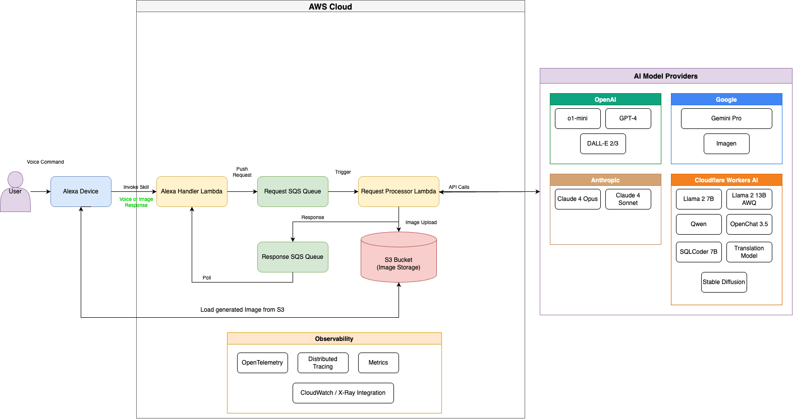
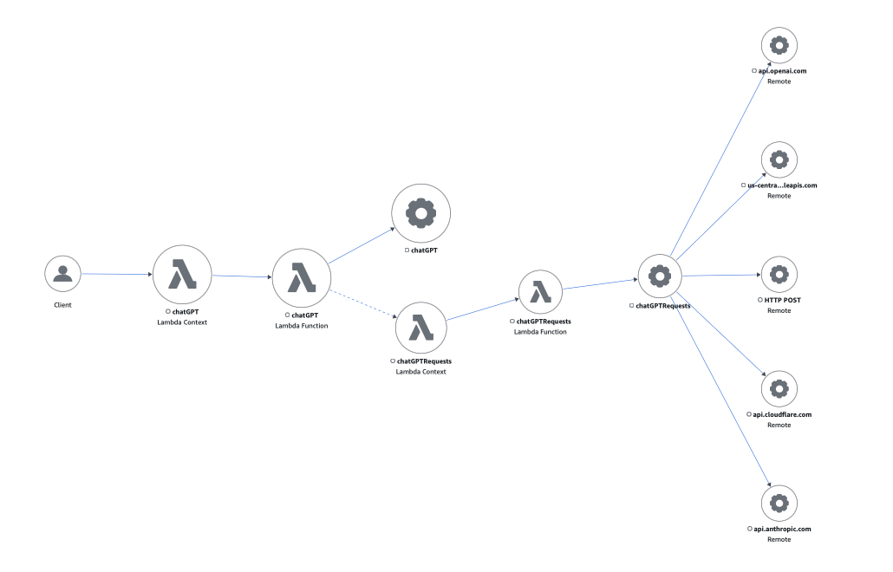

# Alexa-ChatGPT

> 🎤 A production-ready serverless Alexa skill backend that seamlessly integrates with multiple generative AI providers, enabling natural conversations with OpenAI GPT, Google Gemini, Anthropic Claude, Cloudflare AI, and more through your Alexa device.

[git]: https://git-scm.com/
[golang]: https://golang.org/
[modules]: https://github.com/golang/go/wiki/Modules
[golint]: https://github.com/golangci/golangci-lint
[aws-cli]: https://docs.aws.amazon.com/cli/latest/userguide/cli-chap-install.html
[aws-cli-config]: https://docs.aws.amazon.com/cli/latest/userguide/cli-chap-configure.html
[aws-sam-cli]: https://github.com/awslabs/aws-sam-cli

[](https://goreportcard.com/report/github.com/jackmcguire1/alexa-chatgpt)
[](https://codecov.io/gh/jackmcguire1/alexa-chatgpt)
[](https://opensource.org/licenses/MIT)
[](https://golang.org/dl/)

## 🌟 Key Features

- **Multi-Provider AI Support**: Seamlessly switch between OpenAI, Google, Anthropic, and Cloudflare models
- **Optional Client Initialization**: Only configured providers are initialized - no need to set up all API keys
- **Asynchronous Processing**: Handles Alexa's timeout constraints with intelligent queue management
- **Image Generation**: Create images with DALL-E, Stable Diffusion, and Google Imagen
- **Interactive Games**: Built-in number guessing and battleship games
- **Translation Support**: Real-time language translation capabilities
- **Production Ready**: Complete with observability, error handling, and retry mechanisms
- **Cost Effective**: Leverage Cloudflare Workers AI for budget-friendly inference

## Table of Contents
- [Architecture Overview](#architecture-overview)
- [Supported Models](#supported-models)
- [Alexa Intents & Phrases](#alexa-intents--phrases)
- [Quick Start](#quick-start)
- [Detailed Setup Guide](#detailed-setup-guide)
- [Examples](#examples)
- [Troubleshooting](#troubleshooting)
- [API Integration Details](#api-integration-details)
- [Contributing](#contributing)

## Architecture Overview

The skill uses an asynchronous architecture to handle the Alexa 8-second timeout constraint:

1. User prompts the Alexa skill
2. Alexa invokes the Lambda function with the user's intent
3. Lambda pushes the request to an SQS queue
4. A separate Lambda processes the request using the selected AI model
5. The response is placed on a response SQS queue
6. The original Lambda polls for the response

> [!CAUTION]
> Due to Alexa's ~8 second timeout constraint:
> - If no response is received within ~7 seconds, Alexa responds with "your response will be available shortly!"
> - Users can retrieve delayed responses by saying "last response"

### Infrastructure Diagrams

#### DrawIO
[DrawIO Infrastructure File](images/alexa-chatgpt-infra-v2.drawio)


#### Xray Trace Map




> 💡 The architecture uses AWS Lambda functions with SQS queues to handle Alexa's timeout constraints while providing access to multiple AI providers. [View/Edit Diagram](images/alexa-chatgpt-infra-v2.drawio)

## Supported Models

### Chat Models

| Provider | Model | Alias | Internal Reference |
|----------|-------|-------|-------------------|
| **OpenAI** | gpt-5-mini | `gpt` | `CHAT_MODEL_GPT` |
| **OpenAI** | gpt-4o | `g. p. t. version number four` | `CHAT_MODEL_GPT_V4` |
| **Google** | gemini-2.0-flash-exp | `gemini` | `CHAT_MODEL_GEMINI` |
| **Anthropic** | claude-opus-4-20250514 | `opus` | `CHAT_MODEL_OPUS` |
| **Anthropic** | claude-sonnet-4-20250514 | `sonnet` | `CHAT_MODEL_SONNET` |
| **Cloudflare** | llama-4-scout-17b-16e-instruct | `llama` | `CHAT_MODEL_META` |
| **Cloudflare** | deepseek-r1-distill-qwen-32b | `qwen` | `CHAT_MODEL_QWEN` |
| **Cloudflare** | gpt-oss-120b | `apache` | `CHAT_MODEL_GPT_OSS` |

### Image Generation Models

| Provider | Model | Alias | Internal Reference |
|----------|-------|-------|-------------------|
| **OpenAI** | dall-e-3 | `dallas` | `IMAGE_MODEL_DALL_E_3` |
| **OpenAI** | dall-e-2 | `dallas v2` | `IMAGE_MODEL_DALL_E_2` |
| **Cloudflare** | stable-diffusion-xl-base-1.0 | `stable` | `IMAGE_MODEL_STABLE_DIFFUSION` |
| **Google** | "imagen-3.0-generate-002" | `gemini image` | `IMAGE_MODEL_GEMINI` |

### Translation Model
- Special model for translations: `CHAT_MODEL_TRANSLATIONS`

## Alexa Intents & Phrases

### Core Conversation Intents

| Intent | Example Phrases | Description |
|--------|----------------|-------------|
| **AutoCompleteIntent** | "question {prompt}" | Main intent for asking questions to the AI |
| **SystemAutoCompleteIntent** | "system {prompt}" | Set a system message context for the AI |
| **LastResponseIntent** | "last response" | Retrieve delayed responses from previous queries |

### Model Management

| Intent | Example Phrases | Description |
|--------|----------------|-------------|
| **Model** | "model <MODEL_ALIAS_HERE>"| Switch to the desired LLM |

### Image Generation

| Intent | Example Phrases | Description |
|--------|----------------|-------------|
| **ImageIntent** | "image {prompt}" | Generate images using AI models |

### Games & Entertainment

| Intent | Example Phrases | Description |
|--------|----------------|-------------|
| **RandomFactIntent** | "random fact" | Get a random fact from the model |
| **Guess** | "guess {number}" | Play a number guessing game |
| **Battleship** | "battleship {x} {y}" | Play battleship game |
| **BattleshipStatus** | "battleship status" | Get current battleship game status |

### Utility Intents

| Intent | Example Phrases | Description |
|--------|----------------|-------------|
| **TranslateIntent** | "translate {source_lang} to {target_lang} {text}" | Translate between two ISO 639-1 language codes.<br><br> uses model ```m2m100-1.2b``` from Meta provided by Cloudflare |
| **SystemMessageIntent** | "system {prompt}" | Get a prompt with combined system role message |
| **SystemContextIntent** | "set system message {prompt}" | Set the message added as context for the role of the model subsequent queries |
| **Purge** | "purge" | Clear the response queue |

### Built-in Alexa Intents

| Intent | Example Phrases | Description |
|--------|----------------|-------------|
| **AMAZON.HelpIntent** | "help" | Get help on available commands |
| **AMAZON.CancelIntent** | "cancel"<br>"menu" | Cancel current operation |
| **AMAZON.StopIntent** | "stop"<br>"exit" | End the skill session |
| **AMAZON.FallbackIntent** | (triggered on unrecognized input) | Handle unrecognized commands |

## Quick Start

### 🚀 Deploy in 5 Minutes

1. **Clone the repository**
   ```bash
   git clone https://github.com/jackmcguire1/alexa-chatgpt.git
   cd alexa-chatgpt
   ```

2. **Set up minimal environment variables**
   ```bash
   export OPENAI_API_KEY=your_openai_api_key
   export S3_BUCKET_NAME=your_deployment_bucket
   ```

3. **Deploy to AWS**
   ```bash
   sam build && sam deploy --guided
   ```

4. **Create Alexa Skill**
   - Go to [Alexa Developer Console](https://developer.amazon.com/alexa/console/ask)
   - Create new skill with "Custom" model
   - Copy the Lambda ARN from deployment output
   - Set as endpoint in Alexa skill

## Detailed Setup Guide

### Prerequisites

- [Git][git]
- [Go 1.21+][golang]
- [golangCI-Lint][golint]
- [AWS CLI][aws-cli]
- [AWS SAM CLI][aws-sam-cli]
- AWS Account
- OpenAI API Account
- Google Cloud Account (for Gemini)
- Anthropic API Account (for Claude)
- Cloudflare Account (for Workers AI)

### Environment Variables

All API provider credentials are optional. The skill will automatically detect which providers are configured and only make those models available.

```bash
# Optional API Provider Credentials (configure only the ones you need)
export OPENAI_API_KEY=your_openai_api_key           # For GPT and DALL-E models
export ANTHROPIC_API_KEY=your_anthropic_api_key     # For Claude models
export CLOUDFLARE_ACCOUNT_ID=your_cloudflare_id     # For Cloudflare AI models
export CLOUDFLARE_API_KEY=your_cloudflare_api_key   # For Cloudflare AI models
export GEMINI_API_KEY=base64_encoded_service_json   # For Gemini models (Google Service Account)

# Required for deployment
export HANDLER=main
export S3_BUCKET_NAME=your_s3_bucket_name           # AWS S3 Bucket for SAM deployment
```

### AWS CLI Configuration

Configure AWS CLI with your credentials:

```bash
aws configure
# Set:
# - AWS Access Key ID
# - AWS Secret Access Key
# - Default region: us-east-1
```

### Deployment Steps

1. **Create Alexa Skill**
   - Create a new Alexa skill in the Alexa Developer Console
   - Set invocation name (e.g., "my assistant")

2. **Configure Intents**
   - Add all custom intents from the [Alexa Intents section](#alexa-intents--phrases)
   - For AutoCompleteIntent, add a slot named `prompt` with type `AMAZON.SearchQuery`
   - Configure sample utterances for each intent

3. **Build and Deploy Backend**

   ```bash
   # Set architecture variables
   export ARCH=GOARCH=arm64
   export LAMBDA_RUNTIME=provided.al2023
   export LAMBDA_HANDLER=bootstrap
   export LAMBDA_ARCH=arm64

   # Build the SAM application
   sam build --parameter-overrides \
     Runtime=$LAMBDA_RUNTIME \
     Handler=$LAMBDA_HANDLER \
     Architecture=$LAMBDA_ARCH

   # Deploy to AWS
   sam deploy --stack-name alexa-chatgpt \
     --s3-bucket $S3_BUCKET_NAME \
     --parameter-overrides \
       Runtime=$LAMBDA_RUNTIME \
       Handler=$LAMBDA_HANDLER \
       Architecture=$LAMBDA_ARCH \
       OpenAIApiKey=$OPENAI_API_KEY \
       GeminiApiKey=$GEMINI_API_KEY \
       AnthropicApiKey=$ANTHROPIC_API_KEY \
       CloudflareAccountId=$CLOUDFLARE_ACCOUNT_ID \
       CloudflareApiKey=$CLOUDFLARE_API_KEY \
     --capabilities CAPABILITY_IAM
   ```

4. **Connect Lambda to Alexa**
   ```bash
   # Get the Lambda ARN
   sam list stack-outputs --stack-name alexa-chatgpt
   ```
   - Copy the `ChatGPTLambdaArn` value
   - In Alexa Developer Console, set this ARN as the Default Endpoint

5. **Test Your Skill**
   - "Alexa, open [your invocation name]"
   - "Question what is the weather today?"
   - "Model gemini" (to switch models)
   - "Last response" (to get delayed responses)

## Examples

### Basic Conversation
```
User: "Alexa, open my assistant"
Alexa: "Hi, let's begin our conversation!"

User: "Question what is machine learning?"
Alexa: [AI responds with explanation]

User: "Model gemini"
Alexa: "Ok"

User: "Question explain quantum computing"
Alexa: [Gemini responds]
```

### Image Generation
```
User: "Image a sunset over mountains"
Alexa: "Your image will be ready shortly!"

User: "Last response"
Alexa: "Image generated and uploaded to S3"
```

### Model Management
```
User: "Model which"
Alexa: "I am using the text-model gpt and image-model dallas"

User: "Model available"
Alexa: "The available chat models are: gpt, gemini, opus, sonnet, llama, qwen, apache..."
```

## API Integration Details

### OpenAI Integration
- Models: gpt-5-mini, gpt-4o
- Used for general conversation and DALL-E image generation
- Requires `OPENAI_API_KEY`

### Google Vertex AI / Gemini Integration
- Model: Gemini Pro
- GOOGLE Service account JSON must be base64 encoded
- Requires `GEMINI_API_KEY`

### Anthropic Integration
- Models: Claude 3 Opus, Claude 3 Sonnet
- Premium conversational AI models
- Requires `ANTHROPIC_API_KEY`

### Cloudflare Workers AI Integration
- Models: Llama 4 Scout, DeepSeek Qwen, GPT-OSS
- Cost-effective AI inference
- Requires `CLOUDFLARE_ACCOUNT_ID` and `CLOUDFLARE_API_KEY`

## Troubleshooting

### Common Issues

#### "Your response will be available shortly!"
This occurs when the AI takes longer than 7 seconds to respond. Simply say "last response" to retrieve it.

#### Model not responding
- Check API key configuration in environment variables
- Verify the model name in your voice command
- Check CloudWatch logs for detailed error messages

#### Deployment failures
```bash
# Clean and rebuild
sam delete --stack-name alexa-chatgpt
sam build --use-container
sam deploy --guided
```

#### API Rate Limits
If you encounter rate limits:
- Switch to a different model temporarily
- Implement request throttling in your usage
- Consider upgrading your API plan

### Debug Commands

```bash
# View Lambda logs
sam logs -n ChatGPTLambda --stack-name alexa-chatgpt --tail

# Check SQS queue status
aws sqs get-queue-attributes --queue-url <your-queue-url> --attribute-names All

# Test locally
sam local start-lambda
```

## Performance Optimization

### Response Time Improvements

1. **Use Cloudflare Workers AI** for faster response times
2. **Enable Lambda Reserved Concurrency** to reduce cold starts
3. **Optimize prompt length** to reduce processing time
4. **Pre-warm Lambda functions** for consistent performance

## Contributing

This project welcomes contributions! Please feel free to submit pull requests or open issues for bugs and feature requests.

### Development Setup

```bash
# Install dependencies
go mod download

# Run tests
go test ./...

# Build locally
ARCH=arm64 make build
```

## License

This project is licensed under the MIT License - see the [LICENSE](LICENSE.md) file for details.

## Donations

All donations are appreciated!

[](http://paypal.me/crazyjack12)

## Acknowledgments

- OpenAI for GPT models and DALL-E
- Google for Gemini and Vertex AI
- Anthropic for Claude models
- Cloudflare for Workers AI platform
- AWS for serverless infrastructure
- The open-source community for continuous support
